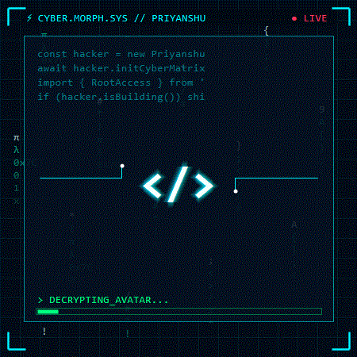

<div align="center">

  <!-- ========================================================================= -->
  <!-- ⚡ CYBERPUNK HEADER (CAPSULE RENDER) -->
  <!-- ========================================================================= -->
  <a href="https://github.com/priyanshusoftware">
    
  </a>

  <!-- ========================================================================= -->
  <!-- 💻 ANIMATED CYBER HUD DASHBOARD BANNER -->
  <!-- ========================================================================= -->
  <p align="center">
    
  </p>

  <!-- ========================================================================= -->
  <!-- ⚡ LIVE DYNAMIC TYPING TERMINAL -->
  <!-- ========================================================================= -->
  <a href="https://github.com/priyanshusoftware">
    
  </a>

</div>

<br/>

<!-- ========================================================================= -->
<!-- 🛡️ SECTION: IDENTITY & BIOMETRIC AVATAR MORPH SEQUENCE -->
<!-- ========================================================================= -->

<div align="center">
  <table border="0" align="center" width="100%">
    <tr>
      <!-- LEFT: ANIMATED MORPHING AVATAR (</> CODE TO CYBER PHOTO) -->
      <td width="42%" align="center" valign="middle">
        
        <br/>
        <sub><code>⚡ MORPH.SEQUENCE: &lt;/&gt; CODE ➔ CYBER_HOLOGRAM ⚡</code></sub>
      </td>
      <!-- RIGHT: TERMINAL SYSTEM SPECIFICATIONS -->
      <td width="58%" valign="middle">
        <br/>
        <code>⚡ <b>root@priyanshusoftware:~#</b> ./load_profile.sh</code>

```yaml
╔══════════════════════════════════════════════════════╗
  ▸ IDENTITY   : Priyanshu (@priyanshusoftware)
  ▸ CLEARANCE  : LEVEL 0x7C3AED [ROOT ACCESS]
  ▸ ROLE       : Full-Stack Developer & Cyber Builder
  ▸ LOCATION   : India 🇮🇳 [28.6139° N, 77.2090° E]
  ▸ OBJECTIVE  : Building High-Performance Web & AI Apps
  ▸ ARSENAL    : Python 🐍 • JavaScript ⚡ • C 🛡️
  ▸ STATUS     : 🟢 100% OPERATIONAL // OVERCLOCKED
╚══════════════════════════════════════════════════════╝
```

<sub><code>&gt; SYSTEM CHECK: ALL PROTOCOLS VERIFIED [ONLINE]</code></sub>

  </td>
 </tr>
</table>
</div>

<br/>

<!-- ========================================================================= -->
<!-- 🛠️ SECTION: CYBER ARSENAL & TECH STACK -->
<!-- ========================================================================= -->

<div align="center">

## ⚡ `CYBER ARSENAL // TECH STACK` ⚡

> *"Crafting high-speed digital architectures with precision and elegance."*

### ⚡ CORE LANGUAGES
<p>
  
  
  
  
  
  
</p>

### ⚛️ FRONTEND & MOBILE ARCHITECTURE
<p>
  
  
  
  
  
</p>

### 🌐 BACKEND, APIS & DATABASES
<p>
  
  
  
  
  
  
  
</p>

### 🛡️ DEVOPS, CYBER & WORKSTATION TOOLS
<p>
  
  
  
  
  
  
</p>

</div>

<br/>

<!-- ========================================================================= -->
<!-- 📊 SECTION: GITHUB TELEMETRY & LIVE METRICS -->
<!-- ========================================================================= -->

<div align="center">

## 📊 `GITHUB TELEMETRY & LIVE STATS` 📊

  <table border="0" align="center" width="100%">
    <tr>
      <!-- GITHUB STATS -->
      <td align="center" valign="middle">
        
      </td>
      <!-- TOP LANGUAGES -->
      <td align="center" valign="middle">
        
      </td>
    </tr>
  </table>

  <!-- STREAK STATS -->
  <p align="center">
    
  </p>

  <!-- CONTRIBUTION SNAKE GRAPH -->
  <h3>🐍 <code>NEURAL CONTRIBUTION MATRIX</code></h3>
  <p align="center">
    
  </p>

</div>

<br/>

<!-- ========================================================================= -->
<!-- 🏆 SECTION: TROPHIES & ACHIEVEMENTS -->
<!-- ========================================================================= -->

<div align="center">

## 🏆 `CYBERNETIC ACHIEVEMENTS` 🏆

  

</div>

<br/>

<!-- ========================================================================= -->
<!-- 📡 SECTION: SECURE UPLINK // CONNECT WITH ME -->
<!-- ========================================================================= -->

<div align="center">

## 📡 `ESTABLISH SECURE CONNECTION` 📡

> *"Got an ambitious idea or want to collaborate on epic projects? Reach out!"*

<p align="center">
  <a href="https://linkedin.com/in/priyanshusoftware" target="_blank">
    
  </a>
  <a href="https://instagram.com/priyanshusoftware" target="_blank">
    
  </a>
  <a href="https://facebook.com/priyanshusoftware" target="_blank">
    
  </a>
  <a href="mailto:priyanshu@example.com" target="_blank">
    
  </a>
  <a href="https://github.com/priyanshusoftware" target="_blank">
    
  </a>
</p>

<br/>

<!-- Visitor Counter -->
<p align="center">
  
</p>

<p align="center">
  <code>⚡ SYSTEM.TERMINATE(0) // END OF LINE ⚡</code>
  <br/>
  <code>&copy; 2026 Priyanshu (@priyanshusoftware) • Keep Building. Keep Hacking.</code>
</p>


</div>
